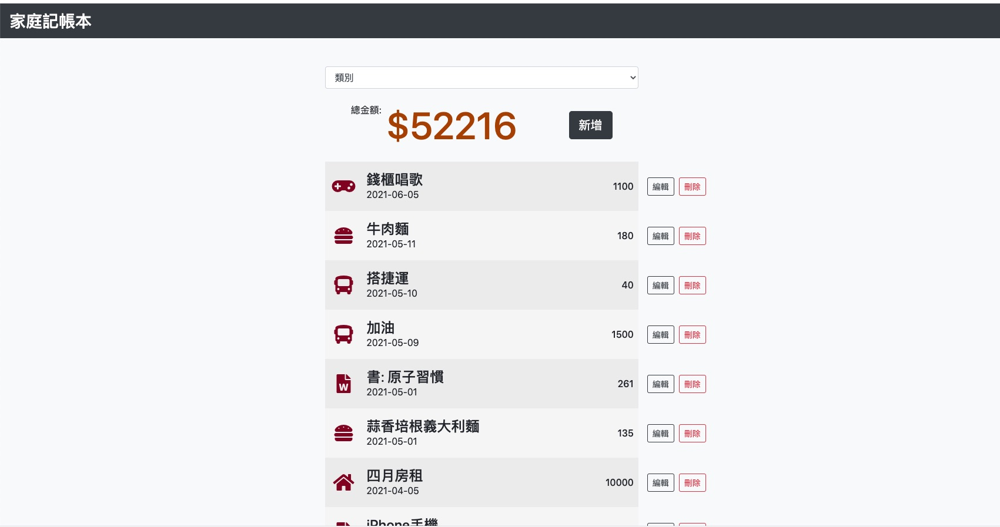

# 老爸私房錢 (Expense Tracker)





## 功能特色
* 首頁瀏覽所有支出
* 首頁看到所有支出的總金額
* 新增支出紀錄
* 編輯任何一筆支出的所有屬性
* 刪除任何一筆支出
* 在首頁可以根據支出「類別」篩選支出；總金額的計算只會包括被篩選出來的支出總和
* 自動依照日期新舊排序
* 間隔行不同色效果
* mouse over 變色效果


## 如何開始

git clone 至電腦

```bash
$ git clone https://github.com/elliotyou/expense-tracker.git
```

進入專案資料夾

```bash
$ cd expense-tracker
```

安裝 npm 套件

```bash
$ npm install
$ npm i nodemon
```

新增種子資料

```bash
$ npm run seed
```

啟動伺服器

```bash
npm run dev
```


## 套件版本

 * Node.js: 14.16.1
 * Express: 4.17.1
 * MondoDB: 4.2.13
 * Express-Handlebars: 5.3.2
 * mongoose: 5.12.7
 * body-parser: 1.19.0


## 作者
Elliot You 游鎮名
